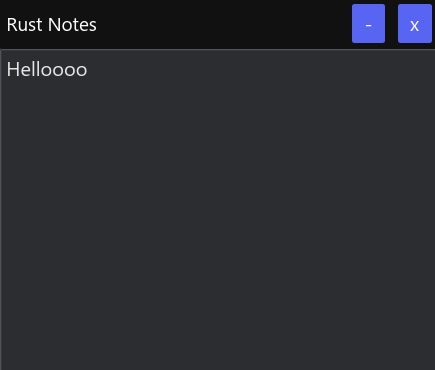

<center><h1>Rust Notes</h1></center>
<center>A simple note taking app</center>




## Build Instructions

1. Clone the repository
2. Run 
    ```bash
    cargo build --release
    ```
3. The command will create an executable in `target/release` directory.
